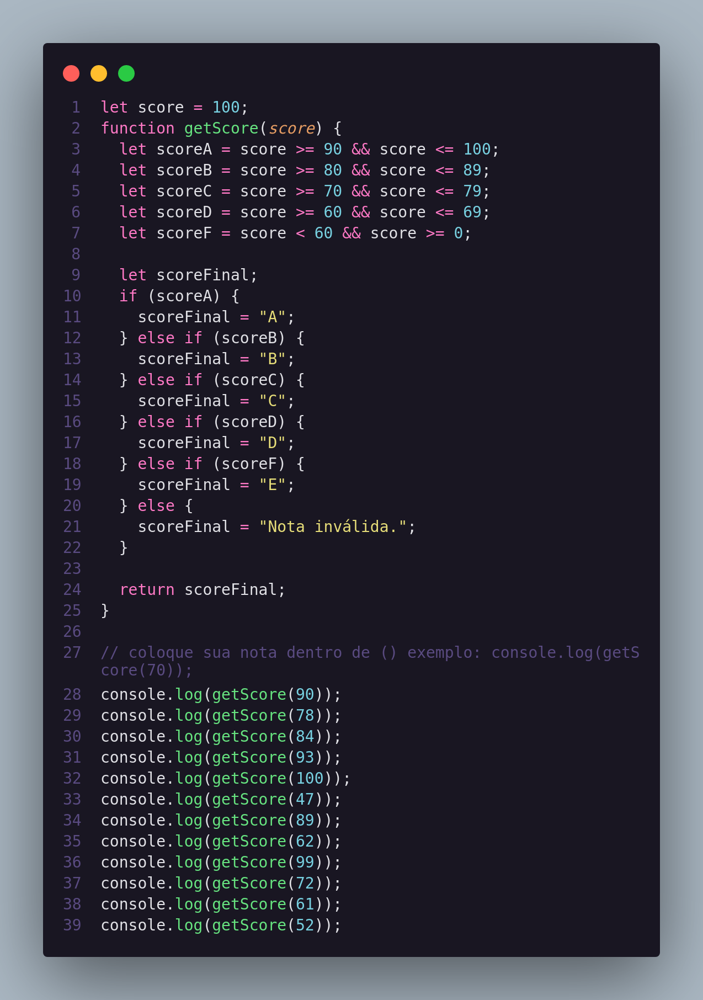
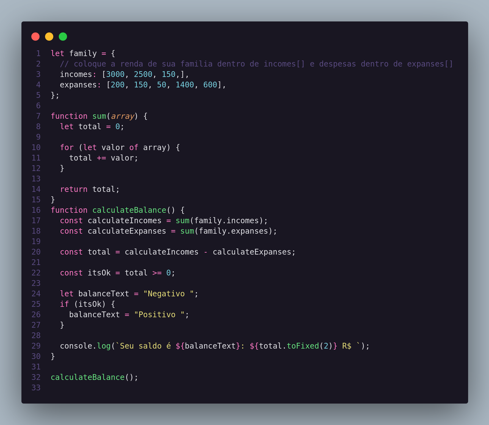
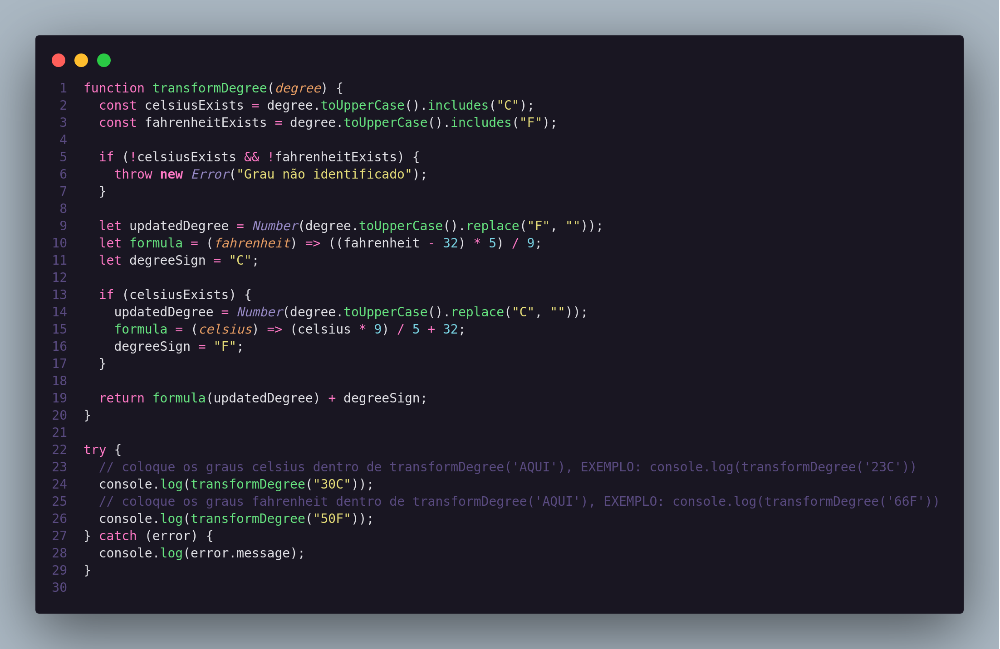
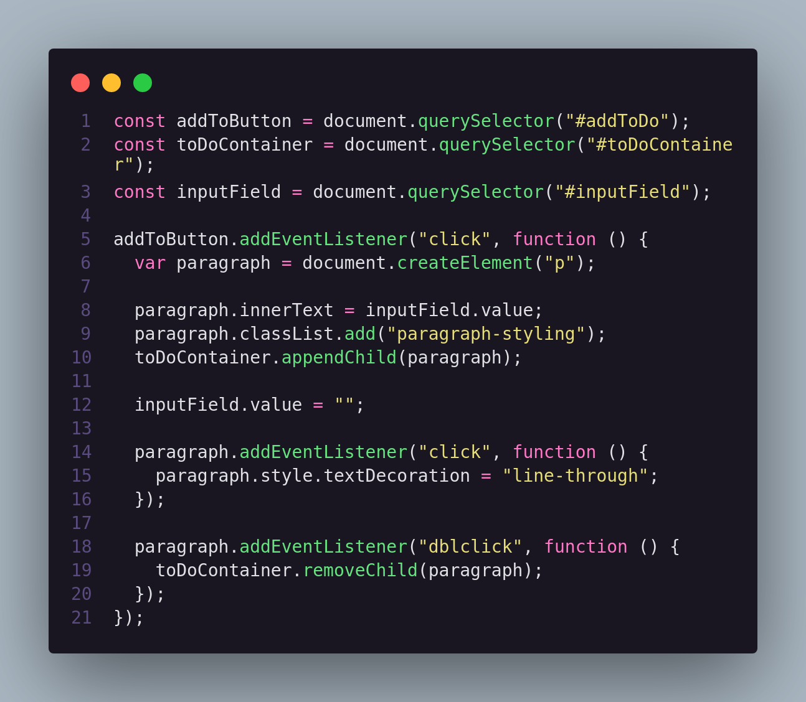
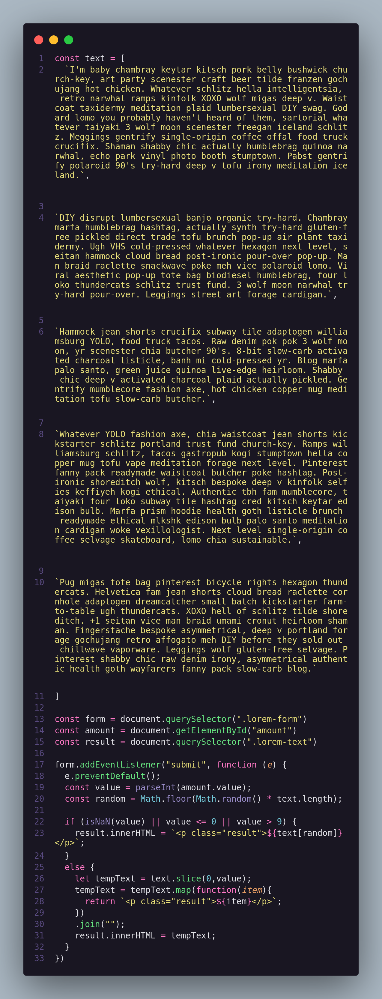
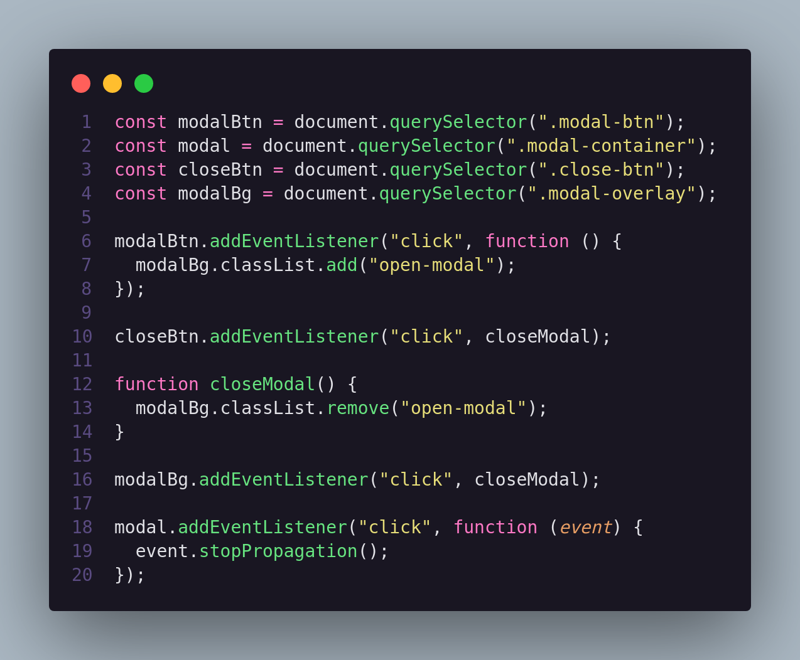
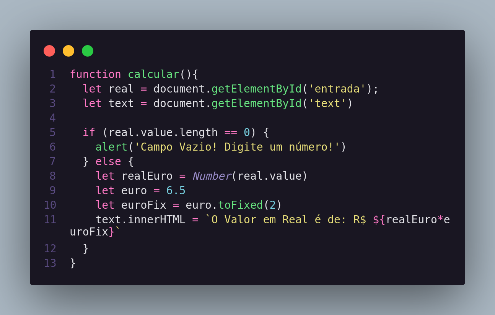
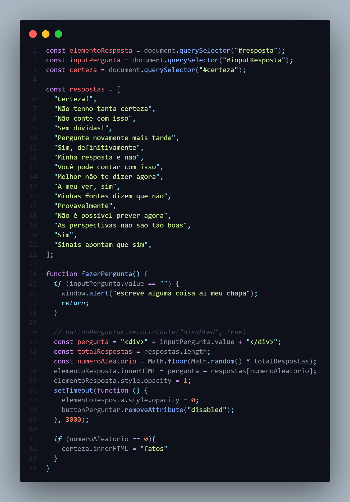

<div align="center"> 
<a href="https://github.com/jonasmfernandes/one-project-per-day-js/blob/main/readme-pt.md">Português</p> 
<a href="https://github.com/jonasmfernandes/one-project-per-day-js/blob/main/readme.md" target="_blank">English</p>
</div>

<h2 align="center">Um projeto por semana JS</h1>

# Índice
   * [Sobre](#sobre)
   * [Tecnologias](#tecnologias)
   * [Projetos](#projetos)
     * [#01 Notas Escolares](#notas-escolares)
     * [#02 Renda Familiar](#renda-familiar)
     * [#03 Conversor de Temperaturas](#conversor-de-temperaturas)
     * [#04 Lista a fazeres](#lista-a-fazeres)
     * [#05 Gerador de Parágrafos](#gerador-de-parágrafos)
     * [#06 Modal](#modal)
     * [#07 Conversor de Euro](#conversor-de-euro)
     * [#08 Bola de cristal](#bola-de-cristal) 
   * [Autor](#autor)
   * [Licença](#licença)

# Sobre

Esse repositório foi criado com o propósito de colocar em prática o que estou aprendendo na linguagem JavaScript. Colocarei um projeto por. 

- - -
# Tecnologias

- [Html](https://developer.mozilla.org/pt-BR/docs/Web/HTML)
- [Css](https://developer.mozilla.org/pt-BR/docs/Web/CSS)
- [JavaScript](https://developer.mozilla.org/pt-BR/docs/Web/JavaScript)

- - -
# Projetos

Aqui serão listados todos os projetos.


## Notas escolares

Esse projeto tem a ideia de converter notas númericas em notas conceituais usando console.log.

[Score](https://github.com/jonasmfernandes/one-project-per-day-js/tree/main/score)

Code:



- - - 

## Renda Familiar

Esse projeto serve para você ver a sua renda familiar. Funciona da seguinte forma: Você cita sua renda, exemplo (3000 de salário) e suas despesas, exemplo (250 de água e 50 de gás). E então o console.log vai te mostrar se você está devendo ou se está sobrando e a quantidade.

[Family-Income](https://github.com/jonasmfernandes/one-project-per-day-js/tree/main/family-income)

Code:



- - - 

## Conversor de Temperaturas

Esse projeto tem a finalidade de converter graus Celsius para Fahrenheit ou vice-versa. Cite a temperatura desejada e o console.log irá mostrar a conversão. 

[Degree-Converter](https://github.com/jonasmfernandes/one-project-per-day-js/tree/main/degree-converter)

Code:



- - - 

## Lista a fazeres 

Este projeto é uma lista a fazeres. Só escrever o que você precisa fazer e ela irá listar embaixo do campo de texto. Dois cliques e você irá excluir o item. 

[To-do-list](https://github.com/jonasmfernandes/one-project-per-day-js/tree/main/to-do-list)

Este projeto está sendo hosteado pelo Netlify: <a href="http://todolist-jonasmfernandes.netlify.app">To-do List</a>

Code: 



- - -

## Gerador de parágrafos

Este projeto é mais elaborado e visualmente mais bonito. É um gerador de paragrafos / texto, apenas digite quantos paragráfos você quer de 0 a 5 e ele te mostrará os parágrafos correspondentes.

[Paragraph-generator](https://github.com/jonasmfernandes/one-project-per-day-js/tree/main/paragraph-generator)

Este projeto está sendo hosteado pelo Netlify: <a href="http://paragraph-generator-jonasmont.netlify.app">Paragraph generator</a>

Code : 



- - -

## Modal 

Este é meu segundo projeto utilizando a manipulação da DOM. É um simples modal, porém aprendi bastante como utilizar ```event.stopPropagation().```

[Modal](https://github.com/jonasmfernandes/one-project-per-day-js/tree/main/modal)

Este projeto está sendo hosteado pelo Netlify: <a href="http://modal-jonasmont.netlify.app">Modal</a>

Code:



- - - 

## Conversor de Euro

Este é meu terceiro projeto utilizando a manipulação da DOM. É um conversor de euro para real.

[Euro Converter](https://github.com/jonasmfernandes/one-project-per-day-js/tree/main/euro-converter)

Este projeto está sendo hosteado pelo Netlify: <a href="https://euroconverter-jonasmont.netlify.app">Conversor de Euro</a>

Code: 



- - -

## Bola de cristal

Este projeto foi feito utilizando a manipulação da DOM. É um adivinhador de respostas.

[Bola de Cristal](https://github.com/jonasmfernandes/one-project-per-day-js/tree/main/marathon-rocketseat)

Este projeto está sendo hosteado pelo Netlify: <a href="https://destiny-jonas.netlify.app">Bola de cristal</a>

Code: 



- - -
# Autor


Feito por Jonas Fernandes. Entre em contato!

[](https://www.instagram.com/joninhasmf/) [](https://www.linkedin.com/in/jonas-monteiro-fernandes-a676641b7/)

- - -

# Licença
Este projeto está sob a licença [MIT](https://opensource.org/licenses/MIT).
